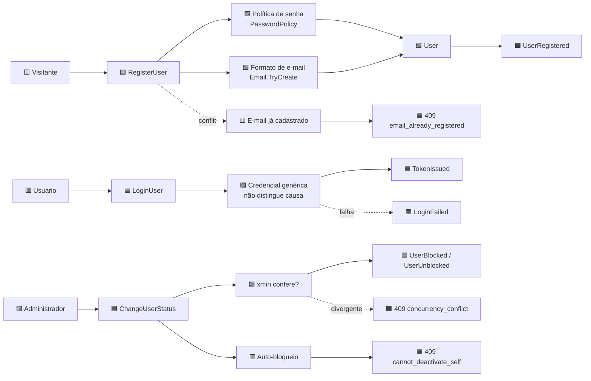

# Event Storming — Cadastro de usuário

> Notação padrão: 🟧 evento · 🟦 comando · 🟨 ator · 🟩 agregado · 🟪 política · 🟥 hotspot ·
> 🟫 leitura
>
> Cada elemento aponta o arquivo que o implementa. Nenhum hotspot aqui é hipótese não implementada.

## Fluxo

## Elementos, com contraparte no código

| Tipo | Elemento | Implementação |
|---|---|---|
| 🟨 Ator | Visitante (anônimo) | rota `POST /api/v1/auth/register`, `[AllowAnonymous]` |
| 🟦 Comando | `RegisterUser` | `Application/Identity/RegisterUserHandler.cs` |
| 🟪 Política | Senha forte | `Domain/Identity/PasswordPolicy.cs` |
| 🟪 Política | Formato e normalização de e-mail | `Domain/Identity/Email.cs` |
| 🟪 Política | Papel nunca vem do cliente | `RegisterRequest` não tem campo `role` — impossibilidade estrutural |
| 🟩 Agregado | `User` | `Domain/Identity/User.cs` |
| 🟧 Evento | `UserRegistered` | log em `Api/Identity/AuthController.cs`, com e-mail mascarado |
| 🟥 Hotspot | E-mail duplicado sob concorrência | pre-check + `UX_Users_Email` + `EmailAlreadyRegisteredException` |
| 🟦 Comando | `LoginUser` | `Application/Identity/LoginUserHandler.cs` |
| 🟪 Política | Falha genérica | conta inexistente, senha errada e conta inativa devolvem o **mesmo** `401 invalid_credentials` |
| 🟧 Evento | `LoginFailed` | log em `AuthController`, com e-mail mascarado |
| 🟦 Comando | `ChangeUserStatus` | `Application/Identity/ChangeUserStatusHandler.cs` |
| 🟪 Política | Concorrência otimista | `xmin` do PostgreSQL como token |
| 🟥 Hotspot | Administrador desativando a si mesmo | `409 cannot_deactivate_self` — checado **antes** de qualquer escrita |
| 🟧 Evento | `UserSelfDeactivationRejected` | log em `AdminUsersController` |

## Os três hotspots, e como foram resolvidos

**1 · E-mail duplicado sob concorrência.** Duas requisições simultâneas passam pelo pre-check
juntas. A garantia real é o índice único `UX_Users_Email`: a Infrastructure traduz o `23505` do
PostgreSQL numa exceção tipada, e o caso de uso a converte em `409`. Provado com dois escritores
reais contra PostgreSQL.

**2 · Enumeração de contas.** Se o login distinguisse "e-mail não existe" de "senha errada", um
atacante mapearia quem tem conta. As três causas devolvem resposta idêntica — e a verificação de
senha roda **mesmo quando a conta não existe**, com um hash descartável, para não vazar a diferença
pelo tempo de resposta.

**3 · Perda de acesso administrativo.** Um admin poderia se bloquear e ninguém mais administraria o
sistema. A guarda retorna antes de tocar o banco. Reativar a própria conta continua permitido — o
card fala em auto-*bloqueio*.

## O que deliberadamente não virou requisito

Confirmação por e-mail, recuperação de senha, refresh token e bloqueio permanente de origem
apareceram como possibilidade durante a modelagem. Nenhum está no enunciado e nenhum foi
implementado — registrá-los como hotspot resolvido seria inventar escopo.
