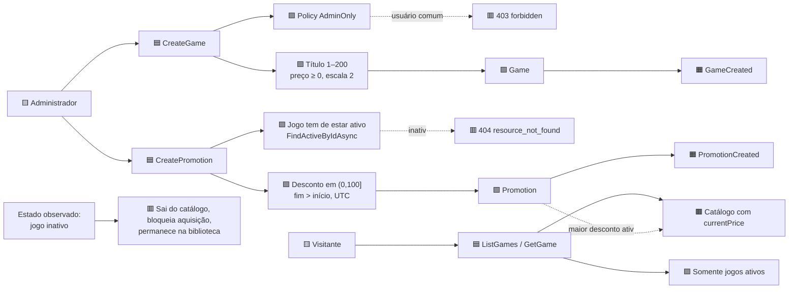

# Event Storming — Cadastro de jogo

> Mesma notação do fluxo de usuário. Cada elemento aponta o arquivo que o implementa.

## Fluxo

## Elementos, com contraparte no código

| Tipo | Elemento | Implementação |
|---|---|---|
| 🟨 Ator | Administrador | claim `role` = `Administrator` |
| 🟪 Política | Autorização | `IdentityPolicies.AdminOnly` — policy, nunca `if` no controller |
| 🟥 Hotspot | Usuário comum tentando cadastrar | `403 forbidden` |
| 🟦 Comando | `CreateGame` | `Application/Catalog/CreateGameHandler.cs` |
| 🟩 Agregado | `Game` | `Domain/Catalog/Game.cs` |
| 🟪 Política | Autoria registrada | `CreatedByUserId` vem do claim `sub`, nunca do corpo |
| 🟧 Evento | `GameCreated` | log em `Api/Catalog/GamesController.cs` |
| 🟦 Comando | `CreatePromotion` | `Application/Catalog/CreatePromotionHandler.cs` |
| 🟩 Agregado | `Promotion` | `Domain/Catalog/Promotion.cs` |
| 🟪 Política | Vigência semiaberta `[início, fim)` | `Promotion.IsActiveAt` — o instante final **não** é ativo |
| 🟪 Política | Maior desconto ativo vence | `Domain/Catalog/PricingService.cs` |
| 🟫 Leitura | Catálogo público | `GET /api/v1/games` e `/games/{id}`, anônimos |
| 🟥 Hotspot | Lifecycle do jogo inativo | ver abaixo |

## Os três hotspots, e como foram resolvidos

**1 · Sobreposição de promoções.** Duas promoções podem valer ao mesmo tempo para o mesmo jogo —
**isto é permitido por design**. Preço = base × (1 − maior desconto ativo). A alternativa ingênua
seria proibir sobreposição com um "verifica-se-existe-antes-de-inserir", que sob `READ COMMITTED`
é uma corrida de *write skew*: dois administradores conferem ao mesmo tempo, ambos veem livre,
ambos gravam. O risco foi **projetado para fora**, não mitigado — não existe nenhuma checagem de
sobreposição no código.

**2 · Autoria da promoção e do jogo.** Ambos guardam quem criou, vindo do token. Um corpo de
requisição com `createdByUserId` é ignorado — o campo não existe no DTO.

**3 · Lifecycle do jogo inativo.** Três regras que precisam coexistir sem se atrapalhar:

> A Fase 1 possui a transição de domínio `Game.Deactivate`, mas não expõe um comando HTTP para
> desativar jogos. O diagrama representa as consequências do estado inativo sem prometer uma rota
> administrativa que não existe.

| Regra | Como |
|---|---|
| Sai do catálogo público | `SearchActiveAsync` filtra `IsActive`; `FindActiveByIdAsync` devolve nulo |
| Não recebe aquisição nova | a aquisição usa o **mesmo** `FindActiveByIdAsync` — o gate é compartilhado |
| Permanece na biblioteca de quem já adquiriu | a consulta histórica junta `Games` **sem** filtrar `IsActive` |

A armadilha aqui seria um *global query filter* de `IsActive` no `DbContext`: resolveria as duas
primeiras e quebraria a terceira em silêncio. Não existe nenhum, e há teste que falha se alguém
adicionar.

## Campos escolhidos — o que é hipótese

O enunciado não descreve os campos de um jogo. `Title`, `Description`, `BasePrice`, `IsActive` e
`CreatedByUserId` são `[HIPÓTESE]` do grupo, escolhidos pelo mínimo que sustenta catálogo,
promoção e biblioteca. **Não há unicidade de título** — dois jogos podem ter o mesmo nome, o que é
verdade no mercado real e evita uma restrição artificial.
