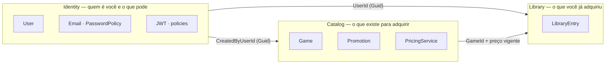

# Mapa de Contexto

Três contextos delimitados dentro de um monólito modular. As fronteiras aparecem diretamente em
`Domain`, `Application` e `Infrastructure`. A `Api` é a borda de transporte compartilhada e se
organiza por tipo (`Controllers` e `Contracts`), sem carregar regra de negócio.



## Como os contextos conversam

**Por identificador e caso de uso — nunca por navegação entre agregados.**

`LibraryEntry` guarda `UserId` e `GameId` como `Guid` puro. Não existe propriedade
`LibraryEntry.User` nem `LibraryEntry.Game`. Um agregado de um contexto não se torna propriedade
de outro; quem precisa cruzar faz um `join` explícito na consulta.

| Origem | Destino | Relação | O que atravessa |
|---|---|---|---|
| Catalog | Library | **Fornecedor → Consumidor** | `Library` chama `IGameRepository.FindActiveByIdAsync` para saber se o jogo existe, está ativo, e qual o preço vigente |
| Identity | Library | **Conformista** | `Library` aceita o `UserId` do token como identidade, sem redefinir o conceito de usuário |
| Identity | Catalog | **Conformista** | `Catalog` guarda `CreatedByUserId` para autoria, sem interpretar papel ou estado |

### O contrato mais importante do mapa

`IGameRepository.FindActiveByIdAsync` é **um gate compartilhado**. Ele devolve nulo para jogo
inexistente **ou** inativo, e traz junto o maior desconto ativo. Isso faz três coisas de uma vez:

1. O catálogo público não mostra jogo inativo.
2. A aquisição não consegue adquirir jogo inativo — não existe caminho para calcular o preço sem
   passar por ele.
3. A criação de promoção também não alcança jogo inativo.

Nenhum dos três precisou de regra própria. Um contrato, três consequências.

## Onde a fronteira é visível no código

```
src/FCG.Domain/{Identity,Catalog,Library}/
src/FCG.Application/{Identity,Catalog,Library}/
src/FCG.Infrastructure/{Identity,Catalog,Library}/
src/FCG.Api/Controllers/
src/FCG.Api/Contracts/
```

A divisão por contexto se repete nas três camadas que contêm regras e persistência. Cada contexto
tem seu módulo de composição (`IdentityModule`, `CatalogModule`, `LibraryModule`), registrado no
`Program.cs`. Controllers e contratos apenas adaptam esses casos de uso para HTTP.

## Por que monólito, e não três serviços

O enunciado exige monólito. Mas a fronteira está desenhada de forma que a separação seja real:
se um dia um contexto precisar sair, o que atravessa a fronteira já é `Guid` e chamada de caso de
uso — não navegação de objeto nem `JOIN` entre agregados de contextos diferentes.
