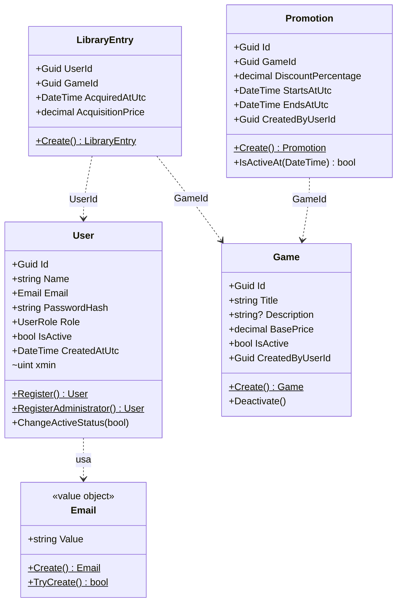

# Mapa de Agregados

Quatro agregados. Cada um é a fronteira de consistência do seu próprio invariante.

## As raízes e seus invariantes

| Agregado | Invariante que protege | Construção |
|---|---|---|
| **User** | Nasce ativo, com papel definido pela factory. Senha nunca é propriedade — só o hash. Nome entre 1 e 120 caracteres. | `User.Register` (sempre `User`) · `User.RegisterAdministrator` |
| **Game** | Preço não-negativo com no máximo 2 casas. Título entre 1 e 200. Autoria obrigatória. | `Game.Create` |
| **Promotion** | Desconto em `(0, 100]`. Fim estritamente depois do início. Datas em UTC. | `Promotion.Create` |
| **LibraryEntry** | Preço não-negativo com 2 casas. Identificadores não vazios. Data em UTC. | `LibraryEntry.Create` |

**Todos os construtores são privados.** Estado inválido não é construível por API pública — só as
factories, que validam antes de instanciar.

## Value Object

**`Email`** é o único. É `record` (igualdade por valor), normaliza no `Create` (trim + minúsculas),
e oferece `TryCreate` para quando a falha é esperada — validar entrada do usuário — em vez de
exceção.

## Serviço de domínio

**`PricingService`** não pertence a nenhum agregado: calcular preço vigente precisa do `Game` e das
`Promotion`s ao mesmo tempo. É função pura, sem estado, sem banco — a peça que mais se parece com
"lógica de negócio" no sentido clássico.

## Referências entre agregados

**Sempre por identificador, nunca por navegação.** `Promotion` tem `GameId`, não `Game`.
`LibraryEntry` tem `UserId` e `GameId`, não os objetos. É o que mantém cada agregado carregável e
salvável sozinho — e o que impede uma transação de arrastar meio banco junto.

## Concorrência

Só `User` tem token de concorrência, porque só ele tem alteração de estado por endpoint
administrativo (`PATCH /admin/users/{id}/status`). Usa **`xmin`**, coluna de sistema do PostgreSQL
que o próprio banco rotaciona a cada `UPDATE` — mapeada como *shadow property*, invisível para o
domínio.

`Game` não recebe token: não há endpoint de edição no escopo. Entra junto com `PUT /games/{id}` se
a Fase 2 o criar.
