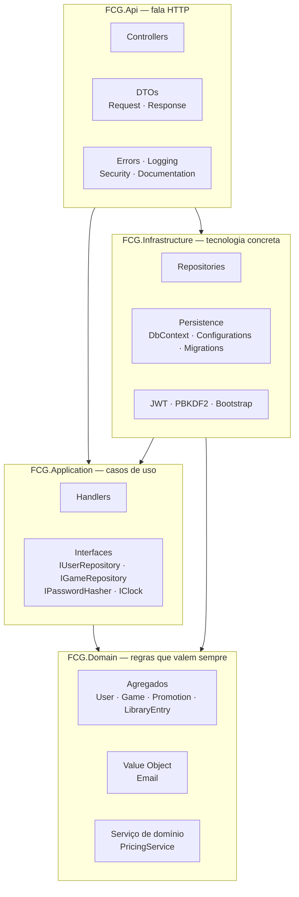

# Arquitetura em camadas

## A regra de dependência

**As setas só apontam para dentro.** `Domain` no centro, sem nenhuma referência de projeto e sem
nenhum pacote de framework — nem EF Core, nem ASP.NET, nem driver de banco.

| Projeto | Referencia |
|---|---|
| `FCG.Domain` | **nada** |
| `FCG.Application` | Domain |
| `FCG.Infrastructure` | Application, Domain |
| `FCG.Api` | Application, Infrastructure |

A `Infrastructure` depende da `Application` — e não o contrário — porque é ela quem **implementa**
as interfaces que a Application declara. É a inversão de dependência: a Application diz
*"preciso de alguém que saiba salvar um usuário"* (`IUserRepository`), e a Infrastructure responde
*"eu sei, usando EF Core e PostgreSQL"*.

## As quatro regras invioláveis

Estas dão significado **verificável** à palavra "DDD" neste projeto — cada uma pode ser conferida
por inspeção, e duas por teste automatizado.

| # | Regra | Como é garantida |
|---|---|---|
| 1 | Domain não referencia ninguém | `ArchitectureTests` lê o `.csproj` e falha se aparecer EF Core, ASP.NET ou Npgsql |
| 2 | Controller nunca acessa `DbContext` | Inspeção — nenhum controller injeta `FcgDbContext` |
| 3 | Módulos conversam por identificador | `LibraryEntry` tem `UserId`/`GameId`, não navegação |
| 4 | Entidade EF nunca é DTO | Todo endpoint tem `*Request`/`*Response` próprios |

> A regra 1 é testada lendo o **XML do `.csproj`**, não as referências do assembly compilado. Uma
> primeira versão usava `Assembly.GetReferencedAssemblies()` e não detectava um pacote adicionado
> mas ainda não usado por código — passava em verde com a violação já no projeto.

## O caminho de uma requisição

`POST /api/v1/games` — criar um jogo como administrador:

| # | Camada | Arquivo | O que faz |
|---|---|---|---|
| 1 | Api | `CreateGameRequest.cs` | JSON vira objeto; DataAnnotations barram o óbvio e o `[ApiController]` devolve `400` sozinho |
| 2 | Api | `GamesController.cs` | Policy `AdminOnly` já filtrou; lê o `sub` do token e monta o comando |
| 3 | Application | `CreateGameHandler.cs` | Orquestra; traduz falha de entrada em erro de validação |
| 4 | Domain | `Game.cs` | A regra: preço, título, escala decimal, UTC |
| 5 | Infrastructure | `GameRepository.cs` | Grava via EF Core; única camada que sabe que é PostgreSQL |
| 6 | Api | `GameResponse.cs` | Vira DTO de saída, `201` com `Location` |

## Onde mora a lógica

Distribuída com critério, não espalhada:

| Tipo de lógica | Onde | Exemplo |
|---|---|---|
| Invariante que vale sempre | `Domain` | `Game.Create` recusa preço negativo |
| Regra pura de cálculo | `Domain` (serviço) | `PricingService` — maior desconto ativo |
| Orquestração de caso de uso | `Application` | `AcquireGameHandler` — busca, calcula, grava |
| Tradução de erro do banco | `Infrastructure` | `23505` + `UX_Users_Email` → exceção tipada |
| Tradução para HTTP | `Api` | resultado do caso de uso → status code |
